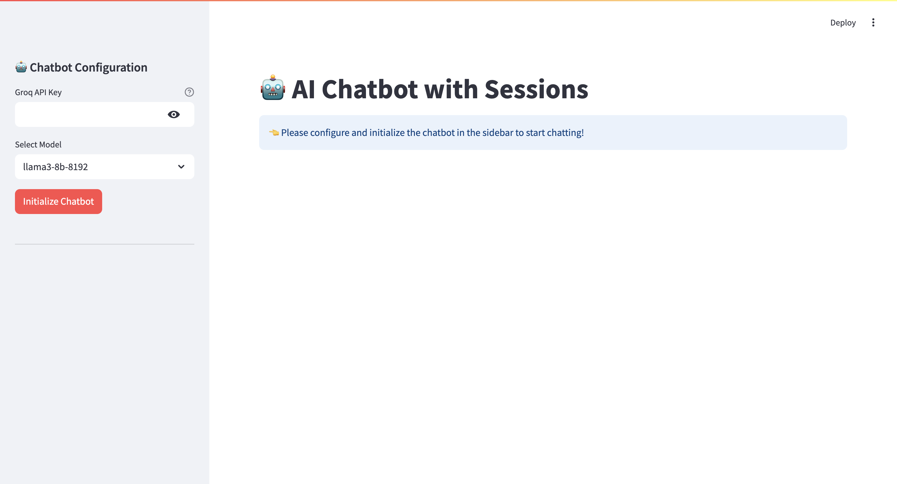
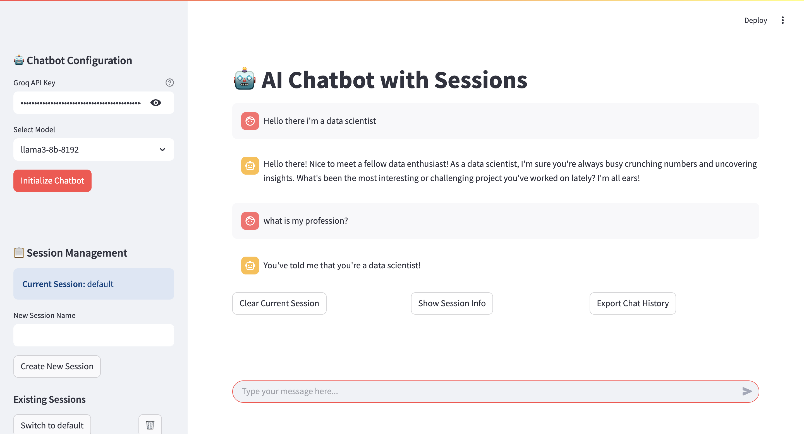

# 🧠 LLM Chatbot with Groq, LangChain & Streamlit

This is a Python application that implements a conversational AI chatbot powered by an LLM using the [Groq API](https://groq.com/), orchestrated with [LangChain](https://www.langchain.com/) and presented through a user-friendly interface built with [Streamlit](https://streamlit.io/). The chatbot supports **chat memory**, allowing it to remember previous messages during a session.

## 🚀 Features

- ✨ Conversational AI with memory support
- 🧠 Retains session-based chat context
- 🔗 Built using LangChain for modular LLM chaining
- ⚡ Powered by Groq API
- 🖥️ Interactive interface with Streamlit
- 🧩 Easy to configure and extend

## 📸 Demo




```bash
streamlit run main.py
```

## 🛠️ Tech Stack

- **Python**
- **LangChain**
- **Groq API**
- **Streamlit**

## 🧑‍💻 Installation

### 1. Clone the Repository

```bash
git clone https://github.com/anismabaziz/chatbot
cd chatbot
```

### 2. Create a Virtual Environment

```bash
python -m venv .venv
source .venv/bin/activate  # On Windows: venv\Scripts\activate
```

### 3. Install Dependencies

```bash
pip install -r requirements.txt
```

### 4. Set Environment Variables

Create a `.env` file in the root directory:

```
GROQ_API_KEY=your_groq_api_key_here
```

### 5. Run the App

```bash
streamlit run main.py
```

## 💬 Example Conversation

```
User: What's the capital of Italy?
Bot: The capital of Italy is Rome.

User: And what about Spain?
Bot: The capital of Spain is Madrid.
```

Thanks to memory, the bot understands the follow-up question without needing repetition.

## 🧠 Memory Details

This app uses LangChain's `RunnableWithMessageHistory` to maintain memory within the session. Memory allows for more natural and contextual responses across multiple interactions.

---
